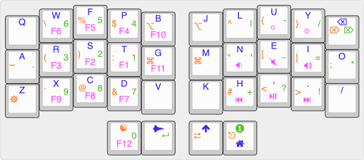

## My 34 key QWERTY Ferris Sweep keymaps

I am using the [Ferris Sweep](https://github.com/davidphilipbarr/Sweep) with **Colemak-DH** layout for: programming with **Python**, **Vim**.

Currently using and enjoying a lot my custom version [pnohty](https://github.com/rayduck/pnohty)

It looks like this, though incomplete, please refer the QMK keymap for the most up-to-date version, especially the combos:

To use it:
1. Add the folder `pnohty` to your QMK keymaps folder in `qmk_firmware/keyboards/ferris/keymaps`
2. Compile with `qmk compile -kb ferris/sweep -km pnohty` (you might need to add other arguments, please refer to the QMK documentation)
3. Flash it to your Ferris Sweep keyboard