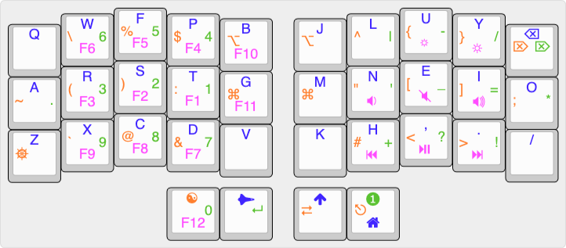

# pnohty — Ferris Sweep keymap

A 34-key [Ferris Sweep](https://github.com/davidphilipbarr/Sweep) layout based on [pnohty](https://github.com/rayduck/pnohty), itself derived from [mini-ryoku](https://github.com/ChuseCubr/mini-ryoku) and [Miryoku](https://github.com/manna-harbour/miryoku).

**Colemak-DH** on the base layer, tuned for programming in **Python** and **Vim** on macOS.



> The diagram above is a rough guide. The keymap source — especially combos — is the source of truth.

## Layers

| Layer | Hold / access | Purpose |
| --- | --- | --- |
| **Home** | default | Colemak-DH alpha keys |
| **Sym** | left thumb (`LT_SYM`) | Brackets, punctuation, symbols |
| **Num** | right thumb (`LT_NUM`) | Numbers and arithmetic symbols |
| **Nav** | from Sym layer (`TO_NAV`) | Arrows, mouse keys, cut/copy/paste, tmux prefix |
| **Fun** | combo `J` + `Backspace` | Function keys, brightness, media |

Layer changes use `TO()` — switching to Nav or Fun replaces the active layer until you return to Home.

## Combos

Combos are enabled on the base layer only (`COMBO_ONLY_FROM_LAYER 0`).

| Combo | Output |
| --- | --- |
| `W` + `F` | Delete word backward (macOS) |
| `F` + `P` | Tab |
| `X` + `C` | One-shot Left Control |
| `C` + `D` | One-shot Left GUI |
| `X` + `D` | One-shot Left Alt |
| `L` + `U` | Enter |
| `U` + `Y` | Escape |
| `J` + `Backspace` | Fun layer |
| `H` + `,` | One-shot Right GUI |
| `,` + `.` | One-shot Right Control |
| `H` + `.` | One-shot Right Alt |
| `G` + `M` | Caps Lock |

## Notable features

- **One-shot modifiers** on home-row inner keys (via `OSM`) and on several combos
- **Mouse keys** on the Nav layer (`MS_LEFT`, `MS_DOWN`, etc.)
- **macOS shortcuts** on Nav: cut/copy/paste, screenshot, tmux prefix (`Ctrl+B`), and accent helpers
- **Bootmagic** enabled for recovery if you flash a bad keymap

## Setup

### Prerequisites

- [QMK](https://docs.qmk.fm/#/newbs) installed and configured
- Ferris Sweep with a **Helios** converter (`CONVERT_TO=helios`)

### Install

Symlink this repository into your QMK tree so edits here are picked up on compile:

```bash
ln -sfn /path/to/qmk-config ~/qmk_firmware/keyboards/ferris/keymaps/pnohty
```

Or run `./build.sh` — it creates the symlink automatically if needed.

### Build

From this repository:

```bash
./build.sh
```

This compiles via QMK and copies the resulting `.uf2` into this repository. The keymap stays symlinked in `qmk_firmware`.

Manual compile:

```bash
qmk compile -kb ferris/sweep -km pnohty -e CONVERT_TO=helios
```

### Flash

Put the board in bootloader mode, then:

```bash
qmk flash -kb ferris/sweep -km pnohty -e CONVERT_TO=helios
```

Or drag `ferris_sweep_pnohty_helios.uf2` onto the RP2040 bootloader drive.

## File overview

| File | Role |
| --- | --- |
| `keymap.c` | Layer definitions |
| `layout.h` | Colemak-DH and layer key assignments |
| `combos.c` | Combo definitions and actions |
| `keycodes.h` | Custom keycode and layer aliases |
| `config.h` | Combo and one-shot tuning |
| `rules.mk` | Enabled QMK features |
| `ferris_sweep_pnohty_helios.uf2` | Pre-built firmware backup (copied by `build.sh`) |
